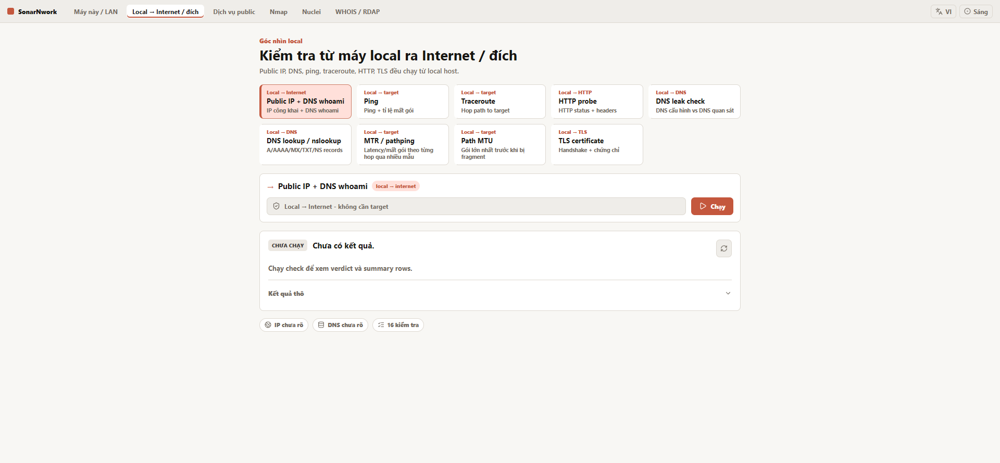
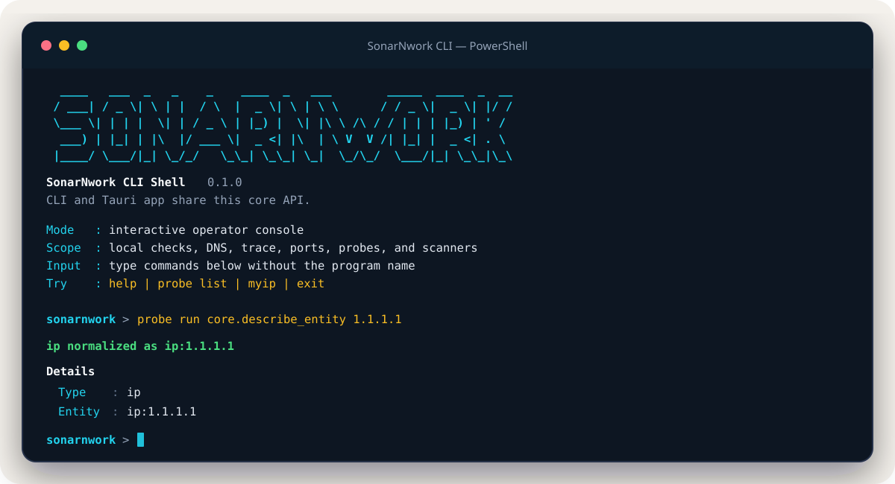

<p align="center">
  
</p>

<h1 align="center">SonarNwork</h1>

<p align="center">
  <strong>Understand the network from your machine to the service you are trying to reach.</strong>
</p>

<p align="center">
  SonarNwork turns scattered network commands into a guided diagnostic workflow,<br />
  with clear conclusions, supporting evidence, and practical next steps.
</p>

<p align="center">
  Rust core &nbsp;·&nbsp; Command-line interface &nbsp;·&nbsp; Tauri desktop app
</p>

<p align="center">
  <a href="https://github.com/Phieu-Tran/SonarNwork/actions/workflows/build.yml"></a>
</p>

<table>
  <tr>
    <td width="50%">
      
    </td>
    <td width="50%">
      
    </td>
  </tr>
  <tr>
    <td align="center"><strong>Guided desktop workflows</strong><br /><sub>Choose the right vantage point and read the evidence visually.</sub></td>
    <td align="center"><strong>A focused, colorful CLI</strong><br /><sub>Run the same core diagnostics from a terminal or script.</sub></td>
  </tr>
</table>

## See where the connection breaks

When someone says “the network is down,” the real problem could be the local
interface, DNS, routing, the Internet path, a remote service, or public ingress.
SonarNwork separates those viewpoints instead of mixing them into one ambiguous
scan.

- **This machine and the LAN** — inspect interfaces, local addresses, gateways,
  DNS resolvers, routes, listening ports, and bind state.
- **Local to Internet or target** — check public IP, DNS, ping, traceroute, HTTP,
  TLS, path MTU, and other path diagnostics from the current machine.
- **Public ingress** — distinguish local evidence from checks that require a
  remote vantage point before claiming that a service is publicly reachable.
- **Public intelligence** — follow guided WHOIS and RDAP lookup flows for domains,
  addresses, and endpoints.
- **Managed tools** — work with external scanners such as Nmap and Nuclei through
  explicit targets, command previews, and controlled execution flows.

## Built to explain, not just execute

SonarNwork is designed for both quick troubleshooting and deeper technical
verification:

- A readable verdict and summary appear before the raw output.
- Direction and vantage labels explain where a check actually runs.
- Suggested next steps help turn observations into a troubleshooting path.
- Raw evidence and command previews remain available when details matter.
- Scope confirmation keeps potentially sensitive operations intentional.

> Only inspect systems that you own or are explicitly authorized to assess.

## One engine, two ways to work

The CLI and desktop app share the same Rust core, serialized data types, scope
rules, and result interpretation. A diagnostic should mean the same thing whether
it is launched from a terminal or selected in the interface.

| Experience | Best for |
| --- | --- |
| **Desktop app** | Discovering available checks, following guided workflows, and reading results visually |
| **CLI** | Fast terminal diagnostics, scripting, reproducible commands, and automation |

Running `sonar` without arguments in a real terminal opens the keyboard-first
TUI. Type `/` to filter workflows, use `Tab`/`Shift-Tab` to move through a
form, and press `F5` to run or `F6` to stop. Live output follows the newest line
by default; `PageUp`/`PageDown` inspect earlier output and `End` returns to the
tail. The transcript is bounded in both lines and memory, with a visible marker
when older output has been discarded.

## Download and install

For published versions, open
[GitHub Releases](https://github.com/Phieu-Tran/SonarNwork/releases) and choose
the package for your operating system. In the commands below, replace `0.1.2`
with the version shown on the release page.

### Windows

- **Portable bundle (recommended):** download
  `SonarNwork-<version>-windows-x64-portable.zip`, extract it to a permanent
  folder, and add that folder to your user `PATH`. It contains `sonar.exe`, the
  compatibility `sonarnwork.exe`, and `sonarnwork-app.exe`, so both the TUI and
  `/open ui` work without extra configuration.
- **Standalone CLI:** download `SonarNwork-CLI-<version>-windows-x64.exe`, put
  it in a folder on `PATH` as `sonar.exe`, then open a new CMD or PowerShell
  window. To use `/open ui`, also install/download the desktop app or set
  `SONARNWORK_DESKTOP_PATH` to its executable.
- **Desktop installer:** install the `.msi` or setup `.exe`. A separately
  installed CLI finds the desktop app in the standard SonarNwork locations; use
  `SONARNWORK_DESKTOP_PATH` if you selected a custom directory.

### Linux (Debian / Ubuntu)

- Download `SonarNwork-<version>-linux-x64.deb`. This one package installs the
  SonarNwork desktop app, `sonar`, and the compatibility `sonarnwork` command,
  so `sonar open ui` works without a second download.

### Install the prebuilt Windows CLI

Open **Command Prompt** and run this after a release has been published. It
does not require Rust:

```cmd
set "VERSION=0.1.2"
set "SONARNWORK_HOME=%LOCALAPPDATA%\Programs\SonarNwork"
if not exist "%SONARNWORK_HOME%" mkdir "%SONARNWORK_HOME%"
curl.exe -fL "https://github.com/Phieu-Tran/SonarNwork/releases/download/v%VERSION%/SonarNwork-CLI-%VERSION%-windows-x64.exe" -o "%SONARNWORK_HOME%\sonar.exe"
set "PATH=%SONARNWORK_HOME%;%PATH%"
sonar --version
```

The `PATH` command applies only to the current CMD window. Add
`%LOCALAPPDATA%\Programs\SonarNwork` to your user `PATH` to make the command
available in future terminals.

### Install a Linux `.deb` with `wget`

On Debian or Ubuntu, one package installs both the CLI and desktop app:

```bash
VERSION="0.1.2"
wget -O sonarnwork.deb "https://github.com/Phieu-Tran/SonarNwork/releases/download/v${VERSION}/SonarNwork-${VERSION}-linux-x64.deb"
sudo apt install ./sonarnwork.deb
sonar --version
sonar open ui
```

### Build the CLI from source (Rust required)

With Rust installed, open **Command Prompt** and install both CLI names directly
from the repository:

```cmd
cargo install --git https://github.com/Phieu-Tran/SonarNwork.git --locked --package sonar-cli
where sonar
sonar --version
sonar
```

Verify the command from a new terminal:

```powershell
where.exe sonar
sonar --version
sonar
```

Inside the TUI, type `/open ui` and press Enter to launch the desktop app. The
same action is also available non-interactively as `sonar open ui`.

Every release also includes SHA-256 checksums and a CycloneDX SBOM. Managed
tools such as Nmap and Nuclei remain optional and are never bundled.

## Try it

You will need a Rust toolchain, Node.js, `pnpm`, and the system dependencies
required by Tauri.

Install both CLI executable names from source:

```powershell
cargo install --path crates/sonar-cli --locked
sonar
```

Or run commands directly from the workspace:

```powershell
cargo run -p sonar-cli --bin sonar -- info
cargo run -p sonar-cli --bin sonar -- check example.com
cargo run -p sonar-cli --bin sonar -- ping 1.1.1.1 --count 4 --timeout 1000
cargo run -p sonar-cli --bin sonar -- dns example.com --record A
cargo run -p sonar-cli --bin sonar -- probe list
```

CLI exit codes are stable across `--summary`, `--json`, and `--raw` output:

| Code | Meaning |
| ---: | --- |
| `0` | Probe completed healthy |
| `1` | Probe completed but reported an unhealthy result |
| `2` | Invalid command or input |
| `3` | Required dependency or external tool is unavailable |
| `4` | Scope or authorization was denied |
| `5` | Timeout, cancellation, or internal operation failure |

Or launch the desktop app in development mode:

```powershell
cd app
pnpm install
pnpm tauri dev
```

For `sonar open ui` against a local release build, point the CLI at the desktop
binary once from the repository root:

```powershell
$env:SONARNWORK_DESKTOP_PATH = (Resolve-Path ".\target\release\sonarnwork-app.exe")
sonar open ui
```

## Under the hood

SonarNwork keeps product behavior in reusable workspace crates instead of
duplicating it across user interfaces:

| Component | Responsibility |
| --- | --- |
| `crates/sonar-core` | Entities, probe contracts, scope rules, pivot graph, and result interpretation |
| `crates/sonar-cli` | Terminal interface over the shared core |
| `app/` | React interface and Tauri desktop shell |
| `crates/sonar-os` | Operating-system abstraction |
| `crates/sonar-tools` | External-tool contracts and lifecycle |
| `crates/sonar-report` | Report and export support |

SonarNwork is under active development. The implementation remains the source of
truth when a documented capability and the current behavior differ.
